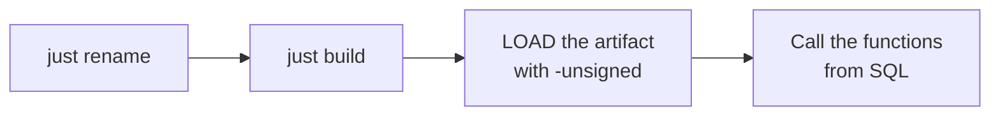

# Quick start

The whole page in four steps:



## Prerequisites

- **Rust** 1.86 or newer (`rust-version` in `Cargo.toml`).
- **[just](https://github.com/casey/just)** — the tool the recipes call:

  ```shell
  cargo install just
  ```

- **make** (inside Git Bash on Windows) and **Python 3** — the official DuckDB
  `extension-ci-tools` build/test flow, which `just build` runs under the hood (`make configure` +
  `make debug`). `just test` uses the same flow.
- A **DuckDB** binary 1.3 or newer (`duckdb` on `PATH`, or point at it with
  `just DUCKDB=/path/to/duckdb …`).

## 1. Rename the extension

```shell
just rename csv_stats
```

`scripts/rename.sh` rewrites the five places the extension name has to match — `Cargo.toml`
(`[package] name` and `[[example]] name`), `EXTENSION_NAME` in the Makefile, the entry-point symbol in
`src/extension/mod.rs`, the Justfile and the CI workflow — plus every occurrence in the docs, and
regenerates the `Cargo.lock` entry. It finishes by printing what still needs a human pass; the function
names are not part of it, since they are the project's own API.

## 2. Build

```shell
just build          # = make configure && make debug
```

The artifact is `build/debug/duckfn_kuva.duckdb_extension`. There is no C++ step and no local DuckDB
build: the extension is compiled against DuckDB's headers and dispatches through its API table when it
is loaded.

## 3. Load and call it

```shell
just repl           # a DuckDB REPL with the extension already loaded
```

```sql
-- or by hand; -unsigned is required for a locally built extension
duckdb -unsigned -c "LOAD './build/debug/duckfn_kuva.duckdb_extension';"
```

`kuva_render`, running right here — the site preloads the extension from the repository's latest release,
so no local `LOAD` is needed here (a hand-built extension still needs `-unsigned`; see the traps below).
Click **Run** on any block and the chart is drawn in the result area — fullscreen is where zoom and pan
live, and the `Table` tab always holds the raw SVG.

```sql {"type":"duckfn","show":"svg","option":{"height":"360px"}}
-- a scatter plot
SELECT kuva_render('{"width":600,"height":320,"series":[{"type":"scatter","data":[[1,2],[3,4],[5,3]]}]}') AS chart;
```

```sql {"type":"duckfn","show":"svg","option":{"height":"360px"}}
-- several series overlaid on one layout
SELECT kuva_render('{"width":600,"height":320,"series":[{"type":"line","data":[[0,1],[1,2]],"legend":"s"},{"type":"scatter","data":[[0,1.2],[1,1.8]],"legend":"o"}]}') AS chart;
```

The failure path is a runnable block too — it declares that it is supposed to fail:

```sql {"type":"duckfn","expect":"error"}
SELECT kuva_render('{"series":[]}');    -- error: a chart needs at least one series
```

A single query from the command line, without a REPL:

```shell
just sql "SELECT left(kuva_render('{\"series\":[{\"type\":\"scatter\",\"data\":[[1,2],[3,4]]}]}'), 4)"
```

## 4. Run the tests

```shell
just test           # make configure + make debug + make test
```

The faster loop is in [Testing](./testing.md).

## Traps

:::warning[Three things that look like bugs and are not]

- **`-unsigned` is mandatory** when you load a locally built extension. Without it DuckDB refuses
  the file.
- **The artifact file name must stay `<extension name>.duckdb_extension`.** DuckDB finds the
  entry-point symbol through the file name, so a copy called `win.duckdb_extension` fails with
  `did not contain function "duckfn_kuva_init_c_api"`.
- **`make test` does not rebuild.** After changing Rust code run `just ci-build` (or `make debug`)
  first, otherwise the tests run against the previous artifact.

:::

One more, on Windows: if `make debug` reports the artifact is in use, a DuckDB process is
holding `build/debug/duckfn_kuva.duckdb_extension` (usually a `just repl` left open) — close that
process and rebuild. A `.duckdb_extension` is not a renamed DLL: DuckDB's metadata lives at the end of
the file, so copying a DLL over it produces `The metadata at the end of the file is invalid`.
