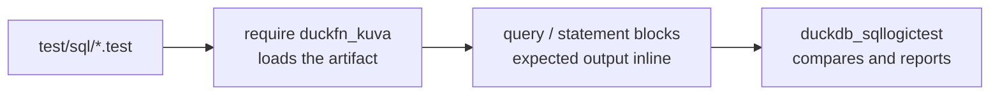

# Testing

Tests are [SQLLogicTest](https://duckdb.org/dev/sqllogictest/intro) files under `test/sql/`, the same
format DuckDB uses for its own test suite. A file is a sequence of `query` and `statement` blocks with
the expected result inline, so a test doubles as a worked example of the function's behaviour.

| File | What it covers |
| --- | --- |
| `duckfn_kuva.test` | The smoke test: `kuva_render` does not exist before `LOAD` and does after `require`; the smallest spec renders an SVG from start to finish (it begins with `<svg` and ends with `</svg>`); every implemented chart type produces output; overlays and multi-panel figures render; and malformed input, an unknown series type, an empty `series` list and a length mismatch each fail with a distinctive message. |

The renderer itself is also covered by Rust unit tests: they are inline `#[cfg(test)] mod tests` blocks at
the bottom of the file they cover — one per chart under `src/extension/functions/spec/convert/charts/`.
`cargo test --lib` runs them, and one check per chart uses
[`quick-xml`](https://crates.io/crates/quick-xml) to confirm each rendered result is well-formed XML.
`just test` runs both halves — `cargo test --lib` and then the SQLLogicTest file.

## Running them

How a file reaches the runner:



```shell
just test                 # = cargo test --lib + make configure + make debug + make test
just ci-build             # just the official build, without the tests
```

`just test` goes through DuckDB's official Makefile flow, which is also what CI runs. Two things to
know about it:

- **It does not rebuild.** After touching Rust code run `just ci-build` (or `make debug`) first, or the
  tests run against the previous artifact.
- **On Windows `make` has to run inside Git Bash**, not PowerShell.

### The fast loop

DuckDB's test runner can drive the artifact directly, which skips `make` entirely. The recipe needs a
Python environment with `duckdb_sqllogictest` installed — `make configure` creates one under
`configure/venv`, or you can use any Python 3 environment that has it:

```bash
# Linux / macOS
./configure/venv/bin/python -m duckdb_sqllogictest \
    --test-dir test/sql \
    --external-extension build/debug/duckfn_kuva.duckdb_extension
```

```powershell
# Windows
.\configure\venv\Scripts\python.exe -m duckdb_sqllogictest `
    --test-dir test/sql `
    --external-extension build/debug/duckfn_kuva.duckdb_extension
```

`--test-dir` is required: it is also the value of `__TEST_DIR__`, the directory a test writing files is
given. To run a single file, add `--file-path test/sql/duckfn_kuva.test`.

## Conventions

- **Every file starts from a clean database**, so `duckfn_kuva.test` can assert that the function does
  not exist before the extension is loaded, then start with `require duckfn_kuva`.
- **Expected errors are matched as substrings.** Under `statement error`, a distinctive fragment of the
  message is enough — there is no need to reproduce DuckDB's whole error string, and doing so ties the
  test to a message that may well change.
- **The result is a big string.** A rendered SVG is thousands of characters long; assert on its edges
  (`left(svg, 4)`, `right(svg, 6)`) or on `length(svg)`, never on the whole document.
- **Divide the files by concern**, not by function count: behaviour in one file, error paths in
  another, and a `.test` that reaches for a community extension (for HTML parsing, say) kept separate,
  because it needs the network the first time.

## What a new function should cover

At least: ordinary values, `NULL`, a boundary value, and the error path. Three more that pay off:

- the node before the `LOAD` (`statement error` … `does not exist`), if the file is the smoke test;
- a NULL input in a chunk that is *not* constant-folded, since a constant `NULL` never reaches the body;
- more rows than `STANDARD_VECTOR_SIZE` (2048), which is what exercises the per-chunk path of a scalar.

Before committing: `just lint` (`cargo clippy --all-targets -- -D warnings`).