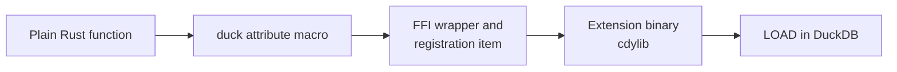

# Writing functions

A registered function is "an ordinary Rust function plus one attribute macro". The macro writes the FFI
wrapper, reads the argument columns, writes the result column, and submits the registration; the body
holds nothing but your logic.

The path from a plain function to a callable SQL function:



## The function

| Function | Kind | Signature | Behaviour |
| --- | --- | --- | --- |
| `kuva_render` | scalar | `VARCHAR -> VARCHAR` | Parses a JSON chart spec and returns an SVG document; never NULL, and any failure is an error. |

It lives in `src/extension/functions/kuva_render.rs` and does nothing but hand its argument to the
`spec` module (`spec::render_json`), which parses the JSON and renders it. The chart schema and the
translation into kuva live under `src/extension/functions/spec/`.

## Scalars: three return shapes

The macro generates different code per return type:

| Signature | Meaning |
| --- | --- |
| `-> T` | A plain value, never NULL. |
| `-> DuckOptionResult<T>` | Nullable and fallible: `Ok(None)` becomes SQL `NULL`, `Err` fails the whole query. |
| `-> Option<T>` | Nullable but unable to fail. |

`kuva_render` uses the middle one: it returns `Ok(Some(svg))` on success and fails the query on any
parse or render error.

```rust
use duckfn::{DuckOptionResult, duck_error, duck_scalar_function};

use super::spec;

#[duck_scalar_function(
    description = "Renders a complete chart described by a JSON string into an SVG document",
    comment = "The full-featured, JSON-based entry point: one JSON object describes canvas, axes, legend, annotations and a heterogeneous list of series",
    example = "SELECT kuva_render('{\"series\":[{\"type\":\"scatter\",\"data\":[[1,2],[3,4],[5,3]]}]}')"
)]
fn kuva_render(spec_json: String) -> DuckOptionResult<String> {
    match spec::render_json(&spec_json) {
        Ok(svg) => Ok(Some(svg)),
        Err(e) => Err(duck_error(format!("kuva_render: {e}"))),
    }
}
```

### What happens to a NULL argument

Argument nullability is decided by the parameter type, and it applies to every kind of function:

- **`spec_json: String`** — a NULL input row is short-circuited to SQL `NULL` by duckfn's argument
  reader; the body never runs for that row. This is what you want most of the time.
- **`spec_json: Option<String>`** — NULL reaches the body as `None` and its meaning is yours to decide
  (return NULL, substitute a default, count NULLs, …).

### Errors and panics

Return `Err(duck_error("…"))` for a value the function cannot handle; that fails the query with your
message. `kuva_render` wraps every `spec::render_json` failure that way, prefixed with the function name,
so a single line of output is readable on its own. A `panic!` in the body is caught and reported as a
DuckDB error rather than unwinding across the FFI boundary. Error messages are user-facing: write them in
English, and prefix them with the function name.

## Beyond scalars

A scalar is the only kind this extension uses today. duckfn also has attributes for aggregates, table
functions, `COPY`, casts, SQL macros and replacement scans; each accepts only its own arguments, and the
chapter per kind in [the duckfn user guide](https://shijianjs.github.io/duckfn/) is the reference.

## Adding your own

1. **Pick the attribute.** Scalar, aggregate, table function, `COPY`, cast, SQL macro or replacement
   scan: each has one, and each accepts only its own arguments. The reference is
   [the duckfn user guide](https://shijianjs.github.io/duckfn/) — the chapter for that kind.
2. **Copy the closest thing** from `src/extension/functions/` and change the logic, rather than
   inventing a signature from scratch.
3. **Attach it to the module tree**: add `mod kuva_your_function;` to `src/extension/functions/mod.rs`.
   The crate roots stay untouched.
4. **Write the documentation metadata** on the attribute — `description`, `comment`, `example` /
   `examples`:

   ```rust
   #[duck_scalar_function(
       description = "One line for the function table of the community-extension page",
       comment = "The detail that does not fit the one-liner",
       example = "SELECT kuva_render('{\"series\":[{\"type\":\"scatter\",\"data\":[[1,2],[3,4]]}]}')"
   )]
   ```

   DuckDB's C extension API has no way to set a description or an example, so this text is the only
   source for the `Added Functions` table on the community-extension page. `just docs_csv` exports it
   to `target/function_descriptions.csv` (see [Community extensions](./community-extension.md)).
   Write it in English — it is pasted onto that page as it is.
5. **Cover it with a test** (see [Testing](./testing.md)) and run `just lint`.

### Names

Every SQL name carries one short prefix (`kuva_` here), and the part after it should read like what the
function does. A prefixed name is also what users type, so resist `kuva_ext_render`.

The attribute registers the **Rust function name** by default, which is why the function is called
`kuva_render`. When one name needs several signatures (different argument types or counts),
`overloads_name = "…"` merges them into one function set instead of registering each separately.

The macro also generates a `SQL_NAME` constant per signature. Once a name appears in several places —
error prefixes, log lines, hints — read that constant rather than repeating the literal; the price is
that such a function has to be `pub(super)`, because the generated module inherits the function's
visibility.

### Options arguments

A configuration argument (`DuckLazy<T>`) is parsed once and read inside the function, so per-row parsing
does not show up in profiles. This extension does not use one; the pattern (a named STRUCT type, created
at load time) is documented in the duckfn guide and used throughout
[duckfn_quantstats](https://github.com/shijianjs/duckfn-quantstats).