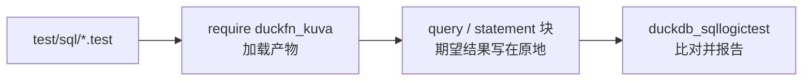

# 测试

测试用 [SQLLogicTest](https://duckdb.org/dev/sqllogictest/intro) 格式写在 `test/sql/` 下，与 DuckDB
自己的测试套件同一种格式。一个文件就是一串 `query` / `statement` 块，期望结果写在原地，所以用例同时也是
函数行为的可运行示例。

| 文件 | 覆盖什么 |
| --- | --- |
| `duckfn_kuva.test` | 冒烟：LOAD 之前 `kuva_render` 不存在、`require` 之后存在；最小的一段规格能从开头到结尾渲染出 SVG（以 `<svg` 开头、以 `</svg>` 结尾）；已实现的每种图型都能产出内容；叠加与多面板图都能渲染；而非法输入、未知 series 类型、空的 `series`、长度不一致等各自以一段醒目的消息失败。 |

渲染器本身还有一组 Rust 单元测试：它们是**内联**的 `#[cfg(test)] mod tests`，贴在被测文件末尾 ——
每种图型一个，在 `src/extension/functions/spec/convert/charts/` 下。`cargo test --lib` 会跑它们，每个图型
都有一项用 [`quick-xml`](https://crates.io/crates/quick-xml) 确认渲染结果合法 XML。
`just test` 两半都跑 —— 先 `cargo test --lib`，再跑 SQLLogicTest 文件。

## 怎么跑

一个文件是怎么走到运行器的：



```shell
just test                 # = cargo test --lib + make configure + make debug + make test
just ci-build             # 只做官方构建，不跑测试
```

`just test` 走 DuckDB 官方的 Makefile 流程，CI 也是这条。两件要知道的事：

- **它不会自动重新构建。** 改完 Rust 先跑 `just ci-build`（或 `make debug`），否则测试跑的是上一次的
  产物。
- **Windows 上 `make` 必须在 Git Bash 里跑**，PowerShell 里跑不起来。

### 更快的迭代

DuckDB 的测试运行器可以直接驱动产物，完全跳过 `make`。它需要一个装了 `duckdb_sqllogictest` 的 Python
环境 —— `make configure` 会在 `configure/venv` 下建一个，你也可以用任何装了这个包的 Python 3 环境：

```bash
# Linux / macOS
./configure/venv/bin/python -m duckdb_sqllogictest \
    --test-dir test/sql \
    --external-extension build/debug/duckfn_kuva.duckdb_extension
```

```powershell
# Windows
.\configure\venv\Scripts\python.exe -m duckdb_sqllogictest `
    --test-dir test/sql `
    --external-extension build/debug/duckfn_kuva.duckdb_extension
```

`--test-dir` 必给：它同时是 `__TEST_DIR__` 的取值，也就是会落盘写文件的用例拿到的目录。只跑一份就再加
`--file-path test/sql/duckfn_kuva.test`。

## 约定

- **每个文件都从干净的数据库开始**，所以 `duckfn_kuva.test` 可以断言加载前函数不存在，随后写
  `require duckfn_kuva`。
- **错误是子串匹配。** `statement error` 下面写有辨识度的那一段就够了，不必抄 DuckDB 整条错误消息 ——
  抄全了反而会把用例绑死在一个随时可能改的文案上。
- **结果是一个大字符串。** 一份渲染好的 SVG 有几千字符；断它的首尾（`left(svg, 4)`、`right(svg, 6)`）
  或 `length(svg)`，不要断整份文档。
- **按关注点拆文件**，不要按函数个数：行为一份、错误路径一份；用到社区扩展（比如解析 HTML）的用例单独
  放，因为它首次运行需要网络。

## 新增函数至少覆盖什么

正常值、`NULL`、边界值、错误路径。另外三条很值：

- 文件是冒烟测试的话，加一条 `LOAD` 之前的 `statement error` … `does not exist`；
- 一条 **不是常量折叠** 的 NULL 输入 —— 常量 `NULL` 根本不会进函数体；
- 行数超过 `STANDARD_VECTOR_SIZE`（2048）的用例 —— 标量的逐 chunk 路径靠它才跑到。

提交前：`just lint`（`cargo clippy --all-targets -- -D warnings`）。