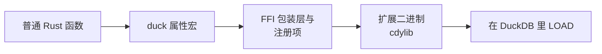

# 编写函数

一个注册进 DuckDB 的函数 = 「一个普通 Rust 函数 + 一个属性宏」。宏负责生成 FFI 包装层、读参数列、写
结果列、提交注册项；函数体里只有你的逻辑。

从一个普通函数到可调用的 SQL 函数：



## 这个函数

| 函数 | 类别 | 签名 | 行为 |
| --- | --- | --- | --- |
| `kuva_render` | 标量 | `VARCHAR -> VARCHAR` | 解析一段 JSON 图表规格并返回 SVG 文档；永不为 NULL，任何失败都是报错。 |

它在 `src/extension/functions/kuva_render.rs` 里，只做一件事：把入参交给 `spec` 模块
（`spec::render_json`）—— 由后者解析 JSON 并渲染。图表的 schema 与到 kuva 的翻译都在
`src/extension/functions/spec/` 下。

## 标量：三种返回形状

宏按返回类型生成不同的代码：

| 签名 | 语义 |
| --- | --- |
| `-> T` | 朴素值，永不为 NULL。 |
| `-> DuckOptionResult<T>` | 可空 + 可报错：`Ok(None)` 落成 SQL `NULL`，`Err` 让整条查询失败。 |
| `-> Option<T>` | 可空，但报不了错。 |

`kuva_render` 用的是中间那种：成功时返回 `Ok(Some(svg))`，解析或渲染出错时让整条查询失败。

```rust
use duckfn::{DuckOptionResult, duck_error, duck_scalar_function};

use super::spec;

#[duck_scalar_function(
    description = "Renders a complete chart described by a JSON string into an SVG document",
    comment = "The full-featured, JSON-based entry point: one JSON object describes canvas, axes, legend, annotations and a heterogeneous list of series",
    example = "SELECT kuva_render('{\"series\":[{\"type\":\"scatter\",\"data\":[[1,2],[3,4],[5,3]]}]}')"
)]
fn kuva_render(spec_json: String) -> DuckOptionResult<String> {
    match spec::render_json(&spec_json) {
        Ok(svg) => Ok(Some(svg)),
        Err(e) => Err(duck_error(format!("kuva_render: {e}"))),
    }
}
```

### 传入 NULL 时会发生什么

参数是否可空由 **参数类型** 决定，对各种函数一视同仁：

- **`spec_json: String`** —— NULL 行被 duckfn 的参数读取层短路成 SQL `NULL`，函数体根本不会执行到那
  一行。多数情况下你要的就是这个。
- **`spec_json: Option<String>`** —— NULL 以 `None` 进函数体，语义由你决定（返回 NULL、换成默认值、
  统计 NULL 行数……）。

### 错误与 panic

遇到处理不了的值就 `Err(duck_error("…"))`，整条查询会带着你的消息失败。`kuva_render` 把
`spec::render_json` 的每种失败都这样包了一层，并带上函数名做前缀，这样单独一行输出也读得懂。函数体里的
`panic!` 会被捕获、作为 DuckDB 错误上报，而不是展开着穿过 FFI 边界。错误信息是给用户看的：用英文写，
并带上函数名做前缀。

## 标量之外

这个扩展目前只用到标量这一种。duckfn 还提供聚合、表函数、`COPY`、cast、SQL 宏、替换扫描等各种属性宏，
每个只接受自己的参数；按类分章的参考见 [duckfn 用户指南](https://shijianjs.github.io/duckfn/zh-Hans/)。

## 新增一个函数

1. **挑属性。** 标量、聚合、表函数、`COPY`、cast、SQL 宏、替换扫描各有一个，而且各自只接受自己的参数。
   参考 [duckfn 用户指南](https://shijianjs.github.io/duckfn/zh-Hans/) —— 对应那一章。
2. **从 `src/extension/functions/` 里抄最接近的那段代码**，只改业务逻辑，不要凭印象自创签名。
3. **挂进模块树**：在 `src/extension/functions/mod.rs` 里加一行 `mod kuva_your_function;`。crate root
   不用动。
4. **写文档元数据**：属性上的 `description`、`comment`、`example` / `examples`：

   ```rust
   #[duck_scalar_function(
       description = "One line for the function table of the community-extension page",
       comment = "The detail that does not fit the one-liner",
       example = "SELECT kuva_render('{\"series\":[{\"type\":\"scatter\",\"data\":[[1,2],[3,4]]}]}')"
   )]
   ```

   DuckDB 的 C 扩展 API 没有设置描述与示例的接口，所以这段文本是社区扩展页 `Added Functions` 表的唯一
   来源。`just docs_csv` 会把它导出到 `target/function_descriptions.csv`（见[社区扩展](./community-extension.md)）。
   文案用英文写 —— 它会被原样贴到那个页面上。
5. **补测试**（见[测试](./testing.md)），然后跑 `just lint`。

### 命名

每个 SQL 名字共用一个短前缀（这里是 `kuva_`），前缀之后的部分要能读出这个函数做什么。这个名字是用户要
敲的，所以别写成 `kuva_ext_render` 这类堆砌。

属性宏默认拿 **Rust 函数名**当注册名，函数因此就叫 `kuva_render`。同一个名字下需要多个签名
（参数类型或个数不同）时，用 `overloads_name = "…"` 把它们并成一个函数集，而不是各自注册一个名字。

宏还会为每个签名生成 `SQL_NAME` 常量。同一个名字要在多处出现时（错误信息前缀、日志、提示），读那个
常量，别再抄一份字面量；代价是这类函数得写成 `pub(super)`，因为生成的模块沿用函数的可见性。

### 配置参数

配置类参数（`DuckLazy<T>`）只在函数内部解析一次，逐行解析不会出现在 profile 里。这个扩展没有用到它；
那套写法（加载时创建命名 STRUCT 类型）在 duckfn 指南里有，
[duckfn_quantstats](https://github.com/shijianjs/duckfn-quantstats) 里也到处都是。